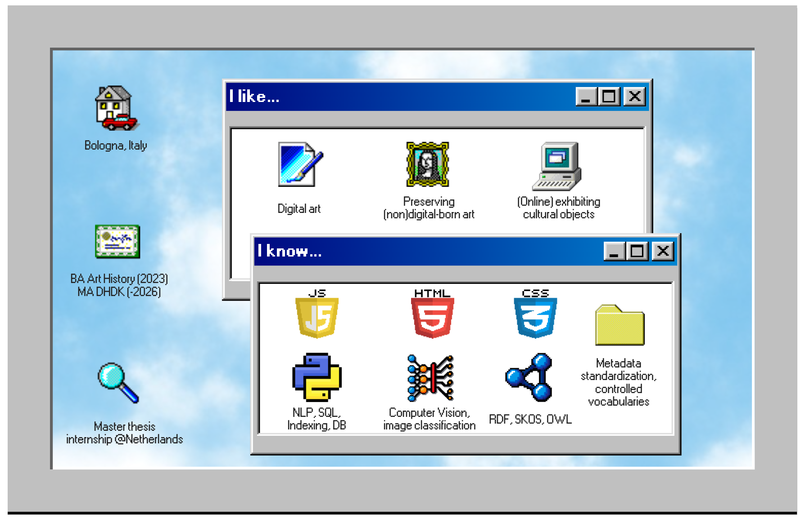

# Hi 👋 I'm Anouk 
## Here is some information about my education, skills and interests ☕

_This is a screenshot of a tiny HTML page I created using elements from a github library (https://github.com/jdan/98.css) and my custom css. It's supposed to represent a computer screen running on Windows 98 because... I like that aesthetic 😅 However, it is not yet entirely finished, so you'll have to enjoy the most recent update of 31-07!_

### Explore my recent projects
#### 🐍 4BytesTheBullets (2024-2025)
Software that processes scholarly journal data (JSON and CSV) and uploads to two databases (Blazegraph and SQL) for simultaneous querying. Our team's architecture for this Data Science project is available in our [github repository](https://github.com/Ant-On-03/4BytesTheBullets) with workflow and UML diagrams.
⚙️ _Data Science Object-oriented programming, python_

#### 🌹 LifeOfDiana (2024-2025)
A [webpage](https://digitalctrlv.github.io/LifeOfDiana/) documenting structured data on Lady Diana Spencer's life using Linked Open Data principles for Libraries, Archives and Museums. From 10 multimedia items describing key moments, we analyzed metadata and built models aligning with formal standards, enabling text to RDF conversion.
⚙️ _Metadata, Digital Archiving, XML, HTML, python_

#### 🧭 Far From Home (2024-2025)
A [virtual exhibition](https://far-fromm-homme.github.io/Far-FroMM-HoMMe/documentation.html)  and digital companion app organizing physical objects for an imaginative museum exhibition. For 'Information Modeling and Web Technologies,' our team researched and emulated current museum web practices for digital collection presentation.
⚙️ _CSS, HTML, JavaScript_

### Previous projects
#### Classification of Modern Sculpture Using Convolutional Neural Networks (2022-2023)
A project scaling the classification of images of modern and contemporary sculptures derived from the collection of Museum Beelden aan Zee in Scheveningen using Convolutional Neural Networks, conducted for the minor Digital Humanities at Leiden University: .
